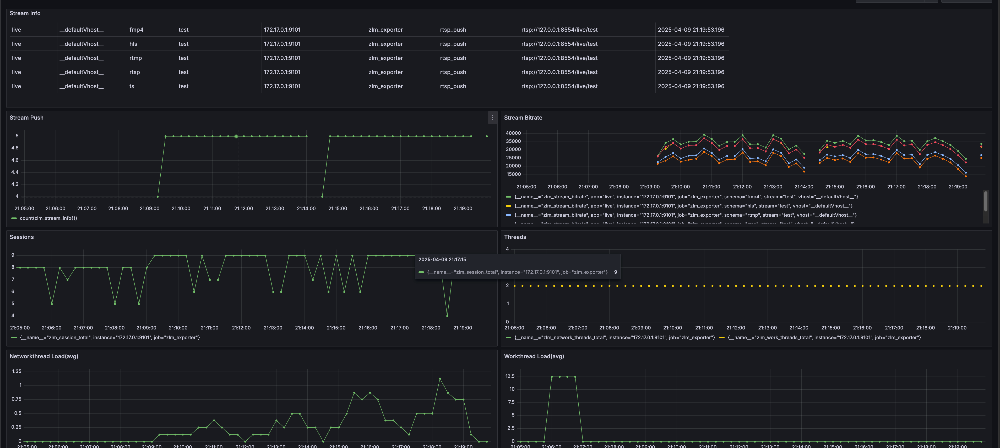
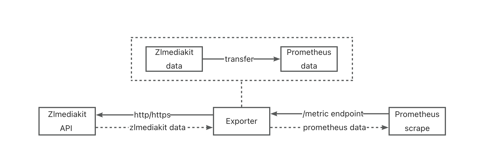

# ZLMediaKit Prometheus Exporter


English | [简体中文](./README_CN.md)

Prometheus exporter for [ZLMediaKit](https://github.com/ZLMediaKit/ZLMediaKit) metrics, written in Go.

> **Upgrading from a pre-1.0 release?** Metric names and the TLS flag changed.
> See [MIGRATION.md](./MIGRATION.md).

[](https://goreportcard.com/report/github.com/guohuachan/ZLMediaKit_exporter)
[](https://github.com/guohuachan/ZLMediaKit_exporter/blob/master/LICENSE)
[](https://en.cppreference.com/)
[](hhttps://github.com/guohuachan/ZLMediaKit_exporter/pulls)

## Grafana DEMO



## Workflow


## Usage

### Prerequisites

```yaml
# prometheus.yml
scrape_configs:
  - job_name: 'zlm_exporter'
    static_configs:
      - targets: ['<zlm_exporter_host>:9101']
```

### Docker

```shell
## pull image
docker pull zlmexporter/zlmexporter:latest
# OR build image
make build-docker

## run container
docker run --rm --name zlm_exporter -p 9101:9101 \
  -e ZLM_API_URL=<zlmediakit_api_uri> \
  -e ZLM_API_SECRET=<zlmediakit_api_secret> \
  zlmexporter/zlmexporter:latest

## get metrics
curl http://localhost:9101/metrics
```

### Source
```shell
## clone repo
git clone https://github.com/guohuachan/ZLMediaKit_exporter
cd ZLMediaKit_exporter
## build
make build
## run
./zlm_exporter --zlm.api-url=<zlmediakit_api_uri> --zlm.secret=<zlmediakit_api_secret>
## get metrics
curl http://localhost:9101/metrics
```

## Command line flags

| Flag | Environment variable | Description |
|---|---|---|
| `zlm.api-url` | `ZLM_API_URL` | ZLMediaKit API server URL. Default `http://127.0.0.1` |
| `zlm.secret` | `ZLM_API_SECRET` | Secret for the ZLMediaKit API |
| `zlm.tls-insecure-skip-verify` | `ZLM_EXPORTER_TLS_INSECURE_SKIP_VERIFY` | Do not verify the ZLMediaKit TLS certificate. Default `false` |
| `zlm.expose-api-status` | `ZLM_EXPORTER_EXPOSE_API_STATUS` | Expose `zlm_api_status`, one constant series per API endpoint. Default `false` |
| `zlm.expose-session-info` | `ZLM_EXPORTER_EXPOSE_SESSION_INFO` | Expose `zlm_session_info`, one series per connection. Default `false` |
| `zlm.expose-stream-tracks` | `ZLM_EXPORTER_EXPOSE_STREAM_TRACKS` | Expose per-track stream metrics. Default `true` |
| `zlm.disable-collectors` | `ZLM_EXPORTER_DISABLE_COLLECTORS` | Comma-separated collectors to skip, e.g. `stream_proxy,stream_pusher` |
| `web.listen-address` | `ZLM_EXPORTER_TELEMETRY_ADDRESS` | Address to expose metrics on. Default `:9101` |
| `web.telemetry-path` | `ZLM_EXPORTER_TELEMETRY_PATH` | Path under which to expose metrics. Default `/metrics` |
| `web.timeout` | `ZLM_EXPORTER_TIMEOUT` | Timeout for a request to ZLMediaKit. Default `15s` |
| `web.metric-only` | `ZLM_EXPORTER_METRIC_ONLY` | Only export ZLMediaKit metrics, not the Go runtime ones. Default `true` |

Collector names accepted by `zlm.disable-collectors`: `version`, `api`,
`network_threads`, `work_threads`, `statistics`, `session`, `stream`,
`stream_proxy`, `stream_pusher`, `rtp`.

> Upgrading from a pre-1.0 release? `--web.ssl-verify` has been removed and TLS
> certificates are now verified by default. See [MIGRATION.md](./MIGRATION.md).

## Metrics

### Exporter

| Metric | Labels | Description |
|---|---|---|
| `zlm_up` | | Was the last scrape of ZLMediaKit successful |
| `zlm_exporter_scrapes_total` | | Total number of scrapes |
| `zlm_exporter_scrape_errors_total` | collector | Scrape errors, per collector |
| `zlm_exporter_scrape_duration_seconds` | collector | Duration of the last scrape, per collector |
| `zlm_exporter_collector_success` | collector | Whether the last scrape of a collector succeeded |
| `zlm_exporter_build_info` | version, revision, branch, goversion, tags | Exporter build information |

### Server

| Metric | Labels | Description |
|---|---|---|
| `zlm_version_info` | branch_name, build_time, commit_hash | ZLMediaKit version |
| `zlm_api_status` | endpoint | Available API endpoints. Opt-in via `--zlm.expose-api-status` |

### Threads

| Metric | Labels | Description |
|---|---|---|
| `zlm_network_threads` | | Number of network (event poller) threads |
| `zlm_network_thread_load_percent` | index | Network thread load in percent |
| `zlm_network_thread_delay_seconds` | index | Network thread task delay |
| `zlm_work_threads` | | Number of work threads |
| `zlm_work_thread_load_percent` | index | Work thread load in percent |
| `zlm_work_thread_delay_seconds` | index | Work thread task delay |

### Object statistics

`zlm_statistics_buffer`, `zlm_statistics_buffer_like_string`,
`zlm_statistics_buffer_list`, `zlm_statistics_buffer_raw`,
`zlm_statistics_frame`, `zlm_statistics_frame_imp`,
`zlm_statistics_media_source`, `zlm_statistics_multi_media_source_muxer`,
`zlm_statistics_rtmp_packet`, `zlm_statistics_rtp_packet`,
`zlm_statistics_socket`, `zlm_statistics_tcp_client`,
`zlm_statistics_tcp_server`, `zlm_statistics_tcp_session`,
`zlm_statistics_udp_server`, `zlm_statistics_udp_session` — live counts of
ZLMediaKit's internal object pools, no labels.

### Sessions

| Metric | Labels | Description |
|---|---|---|
| `zlm_sessions` | typeid, type | Number of sessions by session class and transport |
| `zlm_session_info` | id, identifier, local_ip, local_port, peer_ip, peer_port, typeid, type | Per-connection detail. Opt-in via `--zlm.expose-session-info` |

### Streams

| Metric | Labels | Description |
|---|---|---|
| `zlm_streams` | | Number of source streams |
| `zlm_stream_info` | vhost, app, stream, schema, origin_type, origin_url | Stream information |
| `zlm_stream_status` | vhost, app, stream, schema | 1 when data is flowing |
| `zlm_stream_readers` | vhost, app, stream, schema | Readers of this schema |
| `zlm_stream_total_readers` | vhost, app, stream | Readers across all schemas |
| `zlm_stream_bytes_per_second` | vhost, app, stream, schema | Current throughput in bytes per second |
| `zlm_stream_bytes_total` | vhost, app, stream, schema | Total bytes transferred |
| `zlm_stream_alive_seconds` | vhost, app, stream, schema | Seconds the stream has been alive |
| `zlm_stream_create_time_seconds` | vhost, app, stream, schema | Unix timestamp the stream was created at |
| `zlm_stream_recording` | vhost, app, stream, type | Recording state, `type` is `mp4` or `hls` |

### Stream tracks

Tracks describe the source stream, so they are reported once per stream rather
than once per schema. All carry the labels
`vhost, app, stream, codec_type, codec_name, track_index`. Disable with
`--zlm.expose-stream-tracks=false`.

| Metric | Applies to | Description |
|---|---|---|
| `zlm_stream_track_ready` | all | Whether the track is ready |
| `zlm_stream_track_frames_total` | all | Frames carried by the track |
| `zlm_stream_track_duration_seconds` | all | Track duration |
| `zlm_stream_track_fps` | video | Frames per second |
| `zlm_stream_track_width` | video | Width in pixels |
| `zlm_stream_track_height` | video | Height in pixels |
| `zlm_stream_track_gop_size` | video | GOP size in frames |
| `zlm_stream_track_gop_interval_seconds` | video | GOP interval |
| `zlm_stream_track_key_frames_total` | video | Key frames |
| `zlm_stream_track_sample_rate` | audio | Sample rate in hertz |
| `zlm_stream_track_channels` | audio | Channel count |
| `zlm_stream_track_sample_bit` | audio | Sample bit depth |

### Proxies

Pull proxies (`listStreamProxy`) and push proxies (`listStreamPusherProxy`).
All per-proxy metrics carry `key, vhost, app, stream`.

| Metric | Description |
|---|---|
| `zlm_stream_proxies` | Number of pull proxies |
| `zlm_stream_proxy_info` | Pull proxy information, adds `url` and `status_str` |
| `zlm_stream_proxy_status` | Status as reported by ZLMediaKit, 0 is success |
| `zlm_stream_proxy_live_seconds` | Seconds the proxy has been alive |
| `zlm_stream_proxy_repull_total` | Reconnect count |
| `zlm_stream_proxy_total_readers` | Readers of the proxied stream |
| `zlm_stream_proxy_bytes_per_second` | Current receive rate |
| `zlm_stream_proxy_bytes_total` | Total bytes received |
| `zlm_stream_pushers` | Number of push proxies |
| `zlm_stream_pusher_info` | Push proxy information, adds `url` |
| `zlm_stream_pusher_status` | Status as reported by ZLMediaKit, 0 is success |
| `zlm_stream_pusher_live_seconds` | Seconds the proxy has been alive |
| `zlm_stream_pusher_republish_total` | Reconnect count |
| `zlm_stream_pusher_bytes_per_second` | Current send rate |
| `zlm_stream_pusher_bytes_total` | Total bytes sent |

### RTP

| Metric | Labels | Description |
|---|---|---|
| `zlm_rtp_servers` | | Number of RTP servers |
| `zlm_rtp_server_info` | vhost, app, stream_id, port, ssrc, tcp_mode | RTP server information |

<details>
<summary>Example output</summary>

```
# HELP zlm_exporter_collector_success Whether the last scrape of a collector succeeded (1: yes, 0: no).
# TYPE zlm_exporter_collector_success gauge
zlm_exporter_collector_success{collector="network_threads"} 1
zlm_exporter_collector_success{collector="rtp"} 1
zlm_exporter_collector_success{collector="session"} 1
zlm_exporter_collector_success{collector="statistics"} 1
zlm_exporter_collector_success{collector="stream"} 1
zlm_exporter_collector_success{collector="stream_proxy"} 1
zlm_exporter_collector_success{collector="stream_pusher"} 1
zlm_exporter_collector_success{collector="version"} 1
zlm_exporter_collector_success{collector="work_threads"} 1
# HELP zlm_exporter_scrape_duration_seconds Duration of the last scrape, per collector.
# TYPE zlm_exporter_scrape_duration_seconds gauge
zlm_exporter_scrape_duration_seconds{collector="network_threads"} 0.0031
zlm_exporter_scrape_duration_seconds{collector="rtp"} 0.0031
zlm_exporter_scrape_duration_seconds{collector="session"} 0.0031
zlm_exporter_scrape_duration_seconds{collector="statistics"} 0.0031
zlm_exporter_scrape_duration_seconds{collector="stream"} 0.0031
zlm_exporter_scrape_duration_seconds{collector="stream_proxy"} 0.0031
zlm_exporter_scrape_duration_seconds{collector="stream_pusher"} 0.0031
zlm_exporter_scrape_duration_seconds{collector="version"} 0.0031
zlm_exporter_scrape_duration_seconds{collector="work_threads"} 0.0031
# HELP zlm_exporter_scrape_errors_total Number of errors while scraping ZLMediaKit, per collector.
# TYPE zlm_exporter_scrape_errors_total counter
zlm_exporter_scrape_errors_total{collector="network_threads"} 0
zlm_exporter_scrape_errors_total{collector="rtp"} 0
zlm_exporter_scrape_errors_total{collector="session"} 0
zlm_exporter_scrape_errors_total{collector="statistics"} 0
zlm_exporter_scrape_errors_total{collector="stream"} 0
zlm_exporter_scrape_errors_total{collector="stream_proxy"} 0
zlm_exporter_scrape_errors_total{collector="stream_pusher"} 0
zlm_exporter_scrape_errors_total{collector="version"} 0
zlm_exporter_scrape_errors_total{collector="work_threads"} 0
# HELP zlm_exporter_scrapes_total Current total ZLMediaKit scrapes.
# TYPE zlm_exporter_scrapes_total counter
zlm_exporter_scrapes_total 1
# HELP zlm_network_thread_delay_seconds Network thread task delay in seconds
# TYPE zlm_network_thread_delay_seconds gauge
zlm_network_thread_delay_seconds{index="0"} 0
zlm_network_thread_delay_seconds{index="1"} 0
zlm_network_thread_delay_seconds{index="2"} 0
zlm_network_thread_delay_seconds{index="3"} 0
zlm_network_thread_delay_seconds{index="4"} 0
zlm_network_thread_delay_seconds{index="5"} 0
zlm_network_thread_delay_seconds{index="6"} 0
zlm_network_thread_delay_seconds{index="7"} 0
# HELP zlm_network_thread_load_percent Network thread load in percent
# TYPE zlm_network_thread_load_percent gauge
zlm_network_thread_load_percent{index="0"} 0
zlm_network_thread_load_percent{index="1"} 0
zlm_network_thread_load_percent{index="2"} 0
zlm_network_thread_load_percent{index="3"} 0
zlm_network_thread_load_percent{index="4"} 0
zlm_network_thread_load_percent{index="5"} 0
zlm_network_thread_load_percent{index="6"} 0
zlm_network_thread_load_percent{index="7"} 0
# HELP zlm_network_threads Number of network (event poller) threads
# TYPE zlm_network_threads gauge
zlm_network_threads 8
# HELP zlm_rtp_server_info RTP server info
# TYPE zlm_rtp_server_info gauge
zlm_rtp_server_info{app="rtp",port="10000",ssrc="1234567890",stream_id="test_rtp",tcp_mode="0",vhost="__defaultVhost__"} 1
zlm_rtp_server_info{app="rtp",port="10002",ssrc="987654321",stream_id="other_rtp",tcp_mode="1",vhost="__defaultVhost__"} 1
# HELP zlm_rtp_servers Number of RTP servers
# TYPE zlm_rtp_servers gauge
zlm_rtp_servers 2
# HELP zlm_sessions Number of sessions, by session class and transport
# TYPE zlm_sessions gauge
zlm_sessions{type="tcp",typeid="mediakit::HttpSession"} 1
# HELP zlm_statistics_buffer Statistics buffer
# TYPE zlm_statistics_buffer gauge
zlm_statistics_buffer 10
# HELP zlm_statistics_buffer_like_string Statistics BufferLikeString
# TYPE zlm_statistics_buffer_like_string gauge
zlm_statistics_buffer_like_string 2
# HELP zlm_statistics_buffer_list Statistics BufferList
# TYPE zlm_statistics_buffer_list gauge
zlm_statistics_buffer_list 0
# HELP zlm_statistics_buffer_raw Statistics BufferRaw
# TYPE zlm_statistics_buffer_raw gauge
zlm_statistics_buffer_raw 8
# HELP zlm_statistics_frame Statistics Frame
# TYPE zlm_statistics_frame gauge
zlm_statistics_frame 0
# HELP zlm_statistics_frame_imp Statistics FrameImp
# TYPE zlm_statistics_frame_imp gauge
zlm_statistics_frame_imp 0
# HELP zlm_statistics_media_source Statistics MediaSource
# TYPE zlm_statistics_media_source gauge
zlm_statistics_media_source 1
# HELP zlm_statistics_multi_media_source_muxer Statistics MultiMediaSourceMuxer
# TYPE zlm_statistics_multi_media_source_muxer gauge
zlm_statistics_multi_media_source_muxer 0
# HELP zlm_statistics_rtmp_packet Statistics RtmpPacket
# TYPE zlm_statistics_rtmp_packet gauge
zlm_statistics_rtmp_packet 0
# HELP zlm_statistics_rtp_packet Statistics RtpPacket
# TYPE zlm_statistics_rtp_packet gauge
zlm_statistics_rtp_packet 0
# HELP zlm_statistics_socket Statistics Socket
# TYPE zlm_statistics_socket gauge
zlm_statistics_socket 58
# HELP zlm_statistics_tcp_client Statistics TcpClient
# TYPE zlm_statistics_tcp_client gauge
zlm_statistics_tcp_client 1
# HELP zlm_statistics_tcp_server Statistics TcpServer
# TYPE zlm_statistics_tcp_server gauge
zlm_statistics_tcp_server 43
# HELP zlm_statistics_tcp_session Statistics TcpSession
# TYPE zlm_statistics_tcp_session gauge
zlm_statistics_tcp_session 1
# HELP zlm_statistics_udp_server Statistics UdpServer
# TYPE zlm_statistics_udp_server gauge
zlm_statistics_udp_server 16
# HELP zlm_statistics_udp_session Statistics UdpSession
# TYPE zlm_statistics_udp_session gauge
zlm_statistics_udp_session 0
# HELP zlm_stream_alive_seconds Seconds the stream has been alive
# TYPE zlm_stream_alive_seconds gauge
zlm_stream_alive_seconds{app="live",schema="fmp4",stream="test",vhost="__defaultVhost__"} 7
zlm_stream_alive_seconds{app="live",schema="rtmp",stream="test",vhost="__defaultVhost__"} 7
zlm_stream_alive_seconds{app="live",schema="rtsp",stream="test",vhost="__defaultVhost__"} 7
zlm_stream_alive_seconds{app="live",schema="ts",stream="test",vhost="__defaultVhost__"} 7
# HELP zlm_stream_bytes_per_second Current stream throughput in bytes per second
# TYPE zlm_stream_bytes_per_second gauge
zlm_stream_bytes_per_second{app="live",schema="fmp4",stream="test",vhost="__defaultVhost__"} 31156
zlm_stream_bytes_per_second{app="live",schema="rtmp",stream="test",vhost="__defaultVhost__"} 20680
zlm_stream_bytes_per_second{app="live",schema="rtsp",stream="test",vhost="__defaultVhost__"} 20984
zlm_stream_bytes_per_second{app="live",schema="ts",stream="test",vhost="__defaultVhost__"} 28624
# HELP zlm_stream_bytes_total Total bytes transferred for the stream
# TYPE zlm_stream_bytes_total counter
zlm_stream_bytes_total{app="live",schema="fmp4",stream="test",vhost="__defaultVhost__"} 218094
zlm_stream_bytes_total{app="live",schema="rtmp",stream="test",vhost="__defaultVhost__"} 144761
zlm_stream_bytes_total{app="live",schema="rtsp",stream="test",vhost="__defaultVhost__"} 146891
zlm_stream_bytes_total{app="live",schema="ts",stream="test",vhost="__defaultVhost__"} 200368
# HELP zlm_stream_create_time_seconds Unix timestamp at which the stream was created
# TYPE zlm_stream_create_time_seconds gauge
zlm_stream_create_time_seconds{app="live",schema="fmp4",stream="test",vhost="__defaultVhost__"} 1.731424913e+09
zlm_stream_create_time_seconds{app="live",schema="rtmp",stream="test",vhost="__defaultVhost__"} 1.731424913e+09
zlm_stream_create_time_seconds{app="live",schema="rtsp",stream="test",vhost="__defaultVhost__"} 1.731424913e+09
zlm_stream_create_time_seconds{app="live",schema="ts",stream="test",vhost="__defaultVhost__"} 1.731424913e+09
# HELP zlm_stream_info Stream basic information
# TYPE zlm_stream_info gauge
zlm_stream_info{app="live",origin_type="rtsp_push",origin_url="rtsp://127.0.0.1:554/live/test",schema="fmp4",stream="test",vhost="__defaultVhost__"} 1
zlm_stream_info{app="live",origin_type="rtsp_push",origin_url="rtsp://127.0.0.1:554/live/test",schema="rtmp",stream="test",vhost="__defaultVhost__"} 1
zlm_stream_info{app="live",origin_type="rtsp_push",origin_url="rtsp://127.0.0.1:554/live/test",schema="rtsp",stream="test",vhost="__defaultVhost__"} 1
zlm_stream_info{app="live",origin_type="rtsp_push",origin_url="rtsp://127.0.0.1:554/live/test",schema="ts",stream="test",vhost="__defaultVhost__"} 1
# HELP zlm_stream_proxies Number of stream pull proxies
# TYPE zlm_stream_proxies gauge
zlm_stream_proxies 1
# HELP zlm_stream_proxy_bytes_per_second Current receive rate of the stream pull proxy in bytes per second
# TYPE zlm_stream_proxy_bytes_per_second gauge
zlm_stream_proxy_bytes_per_second{app="proxy",key="__defaultVhost__/proxy/camera1",stream="camera1",vhost="__defaultVhost__"} 20480
# HELP zlm_stream_proxy_bytes_total Total bytes received by the stream pull proxy
# TYPE zlm_stream_proxy_bytes_total counter
zlm_stream_proxy_bytes_total{app="proxy",key="__defaultVhost__/proxy/camera1",stream="camera1",vhost="__defaultVhost__"} 736280
# HELP zlm_stream_proxy_info Stream pull proxy information
# TYPE zlm_stream_proxy_info gauge
zlm_stream_proxy_info{app="proxy",key="__defaultVhost__/proxy/camera1",status_str="success",stream="camera1",url="rtsp://192.168.1.10:554/live/ch0",vhost="__defaultVhost__"} 1
# HELP zlm_stream_proxy_live_seconds Seconds the stream pull proxy has been alive
# TYPE zlm_stream_proxy_live_seconds gauge
zlm_stream_proxy_live_seconds{app="proxy",key="__defaultVhost__/proxy/camera1",stream="camera1",vhost="__defaultVhost__"} 3600
# HELP zlm_stream_proxy_repull_total Number of times the stream pull proxy reconnected
# TYPE zlm_stream_proxy_repull_total counter
zlm_stream_proxy_repull_total{app="proxy",key="__defaultVhost__/proxy/camera1",stream="camera1",vhost="__defaultVhost__"} 2
# HELP zlm_stream_proxy_status Stream pull proxy status as reported by ZLMediaKit (0: success)
# TYPE zlm_stream_proxy_status gauge
zlm_stream_proxy_status{app="proxy",key="__defaultVhost__/proxy/camera1",stream="camera1",vhost="__defaultVhost__"} 0
# HELP zlm_stream_proxy_total_readers Number of readers of the proxied stream
# TYPE zlm_stream_proxy_total_readers gauge
zlm_stream_proxy_total_readers{app="proxy",key="__defaultVhost__/proxy/camera1",stream="camera1",vhost="__defaultVhost__"} 3
# HELP zlm_stream_pusher_bytes_per_second Current send rate of the stream push proxy in bytes per second
# TYPE zlm_stream_pusher_bytes_per_second gauge
zlm_stream_pusher_bytes_per_second{app="live",key="__defaultVhost__/live/test",stream="test",vhost="__defaultVhost__"} 15360
# HELP zlm_stream_pusher_bytes_total Total bytes sent by the stream push proxy
# TYPE zlm_stream_pusher_bytes_total counter
zlm_stream_pusher_bytes_total{app="live",key="__defaultVhost__/live/test",stream="test",vhost="__defaultVhost__"} 276480
# HELP zlm_stream_pusher_info Stream push proxy information
# TYPE zlm_stream_pusher_info gauge
zlm_stream_pusher_info{app="live",key="__defaultVhost__/live/test",stream="test",url="rtmp://cdn.example.com/live/test",vhost="__defaultVhost__"} 1
# HELP zlm_stream_pusher_live_seconds Seconds the stream push proxy has been alive
# TYPE zlm_stream_pusher_live_seconds gauge
zlm_stream_pusher_live_seconds{app="live",key="__defaultVhost__/live/test",stream="test",vhost="__defaultVhost__"} 1800
# HELP zlm_stream_pusher_republish_total Number of times the stream push proxy reconnected
# TYPE zlm_stream_pusher_republish_total counter
zlm_stream_pusher_republish_total{app="live",key="__defaultVhost__/live/test",stream="test",vhost="__defaultVhost__"} 1
# HELP zlm_stream_pusher_status Stream push proxy status as reported by ZLMediaKit (0: success)
# TYPE zlm_stream_pusher_status gauge
zlm_stream_pusher_status{app="live",key="__defaultVhost__/live/test",stream="test",vhost="__defaultVhost__"} 0
# HELP zlm_stream_pushers Number of stream push proxies
# TYPE zlm_stream_pushers gauge
zlm_stream_pushers 1
# HELP zlm_stream_readers Number of readers of the stream
# TYPE zlm_stream_readers gauge
zlm_stream_readers{app="live",schema="fmp4",stream="test",vhost="__defaultVhost__"} 0
zlm_stream_readers{app="live",schema="rtmp",stream="test",vhost="__defaultVhost__"} 0
zlm_stream_readers{app="live",schema="rtsp",stream="test",vhost="__defaultVhost__"} 0
zlm_stream_readers{app="live",schema="ts",stream="test",vhost="__defaultVhost__"} 0
# HELP zlm_stream_recording Whether the stream is being recorded (1: recording, 0: not)
# TYPE zlm_stream_recording gauge
zlm_stream_recording{app="live",stream="test",type="hls",vhost="__defaultVhost__"} 1
zlm_stream_recording{app="live",stream="test",type="mp4",vhost="__defaultVhost__"} 0
# HELP zlm_stream_status Stream status (1: active with data flowing, 0: inactive)
# TYPE zlm_stream_status gauge
zlm_stream_status{app="live",schema="fmp4",stream="test",vhost="__defaultVhost__"} 1
zlm_stream_status{app="live",schema="rtmp",stream="test",vhost="__defaultVhost__"} 1
zlm_stream_status{app="live",schema="rtsp",stream="test",vhost="__defaultVhost__"} 1
zlm_stream_status{app="live",schema="ts",stream="test",vhost="__defaultVhost__"} 1
# HELP zlm_stream_total_readers Number of readers of the stream across all schemas
# TYPE zlm_stream_total_readers gauge
zlm_stream_total_readers{app="live",stream="test",vhost="__defaultVhost__"} 0
# HELP zlm_stream_track_channels Audio track channel count
# TYPE zlm_stream_track_channels gauge
zlm_stream_track_channels{app="live",codec_name="mpeg4-generic",codec_type="audio",stream="test",track_index="0",vhost="__defaultVhost__"} 1
# HELP zlm_stream_track_duration_seconds Track duration in seconds
# TYPE zlm_stream_track_duration_seconds gauge
zlm_stream_track_duration_seconds{app="live",codec_name="H264",codec_type="video",stream="test",track_index="1",vhost="__defaultVhost__"} 5.597
zlm_stream_track_duration_seconds{app="live",codec_name="mpeg4-generic",codec_type="audio",stream="test",track_index="0",vhost="__defaultVhost__"} 3.57
# HELP zlm_stream_track_fps Video track frames per second
# TYPE zlm_stream_track_fps gauge
zlm_stream_track_fps{app="live",codec_name="H264",codec_type="video",stream="test",track_index="1",vhost="__defaultVhost__"} 26
# HELP zlm_stream_track_frames_total Frames carried by the track
# TYPE zlm_stream_track_frames_total counter
zlm_stream_track_frames_total{app="live",codec_name="H264",codec_type="video",stream="test",track_index="1",vhost="__defaultVhost__"} 149
zlm_stream_track_frames_total{app="live",codec_name="mpeg4-generic",codec_type="audio",stream="test",track_index="0",vhost="__defaultVhost__"} 187
# HELP zlm_stream_track_gop_interval_seconds Video track GOP interval in seconds
# TYPE zlm_stream_track_gop_interval_seconds gauge
zlm_stream_track_gop_interval_seconds{app="live",codec_name="H264",codec_type="video",stream="test",track_index="1",vhost="__defaultVhost__"} 0.801
# HELP zlm_stream_track_gop_size Video track GOP size in frames
# TYPE zlm_stream_track_gop_size gauge
zlm_stream_track_gop_size{app="live",codec_name="H264",codec_type="video",stream="test",track_index="1",vhost="__defaultVhost__"} 21
# HELP zlm_stream_track_height Video track height in pixels
# TYPE zlm_stream_track_height gauge
zlm_stream_track_height{app="live",codec_name="H264",codec_type="video",stream="test",track_index="1",vhost="__defaultVhost__"} 960
# HELP zlm_stream_track_key_frames_total Video track key frames
# TYPE zlm_stream_track_key_frames_total counter
zlm_stream_track_key_frames_total{app="live",codec_name="H264",codec_type="video",stream="test",track_index="1",vhost="__defaultVhost__"} 2
# HELP zlm_stream_track_ready Whether the track is ready (1: ready, 0: not)
# TYPE zlm_stream_track_ready gauge
zlm_stream_track_ready{app="live",codec_name="H264",codec_type="video",stream="test",track_index="1",vhost="__defaultVhost__"} 1
zlm_stream_track_ready{app="live",codec_name="mpeg4-generic",codec_type="audio",stream="test",track_index="0",vhost="__defaultVhost__"} 1
# HELP zlm_stream_track_sample_bit Audio track sample bit depth
# TYPE zlm_stream_track_sample_bit gauge
zlm_stream_track_sample_bit{app="live",codec_name="mpeg4-generic",codec_type="audio",stream="test",track_index="0",vhost="__defaultVhost__"} 16
# HELP zlm_stream_track_sample_rate Audio track sample rate in hertz
# TYPE zlm_stream_track_sample_rate gauge
zlm_stream_track_sample_rate{app="live",codec_name="mpeg4-generic",codec_type="audio",stream="test",track_index="0",vhost="__defaultVhost__"} 44100
# HELP zlm_stream_track_width Video track width in pixels
# TYPE zlm_stream_track_width gauge
zlm_stream_track_width{app="live",codec_name="H264",codec_type="video",stream="test",track_index="1",vhost="__defaultVhost__"} 448
# HELP zlm_streams Number of source streams
# TYPE zlm_streams gauge
zlm_streams 1
# HELP zlm_up Was the last scrape of ZLMediaKit successful.
# TYPE zlm_up gauge
zlm_up 1
# HELP zlm_version_info ZLMediaKit version info.
# TYPE zlm_version_info gauge
zlm_version_info{branch_name="master",build_time="2024-06-11T21:28:30",commit_hash="c446f6b"} 1
# HELP zlm_work_thread_delay_seconds Work thread task delay in seconds
# TYPE zlm_work_thread_delay_seconds gauge
zlm_work_thread_delay_seconds{index="0"} 0.005
zlm_work_thread_delay_seconds{index="1"} 0.005
zlm_work_thread_delay_seconds{index="2"} 0.005
zlm_work_thread_delay_seconds{index="3"} 0.005
zlm_work_thread_delay_seconds{index="4"} 0.005
zlm_work_thread_delay_seconds{index="5"} 0.005
zlm_work_thread_delay_seconds{index="6"} 0.005
zlm_work_thread_delay_seconds{index="7"} 0.005
# HELP zlm_work_thread_load_percent Work thread load in percent
# TYPE zlm_work_thread_load_percent gauge
zlm_work_thread_load_percent{index="0"} 0
zlm_work_thread_load_percent{index="1"} 0
zlm_work_thread_load_percent{index="2"} 0
zlm_work_thread_load_percent{index="3"} 100
zlm_work_thread_load_percent{index="4"} 0
zlm_work_thread_load_percent{index="5"} 0
zlm_work_thread_load_percent{index="6"} 0
zlm_work_thread_load_percent{index="7"} 0
# HELP zlm_work_threads Number of work threads
# TYPE zlm_work_threads gauge
zlm_work_threads 8
```

</details>

## Roadmap

- [x] Add git action CI/CD,and trigger docker build and push to docker hub
- [x] GA
- [x] Add grafana dashboard / prometheus alert example
- [x] Make high-cardinality metrics opt-in (`--zlm.expose-*`, `--zlm.disable-collectors`)
- [x] Adapt to current ZLMediaKit: stream tracks, recording state, stream proxies
- [ ] Add more tests

## Contributing and reporting issues

JUST DO IT! 

We appreciate your feedback and contributions!


## Thanks
[ZLMediaKit](https://github.com/ZLMediaKit/ZLMediaKit)

[JetBrains](https://www.jetbrains.com/)

[redis_exporter](https://github.com/oliver006/redis_exporter)

[haproxy_exporter](https://github.com/prometheus/haproxy_exporter)

[Prometheus](https://prometheus.io/)

[Cursor](https://www.cursor.com/)

JetBrains/Cursor provides great IDE for coding.

Most unittest powered by Cursor.