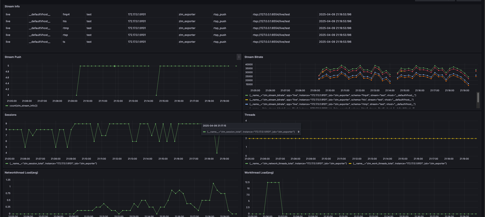
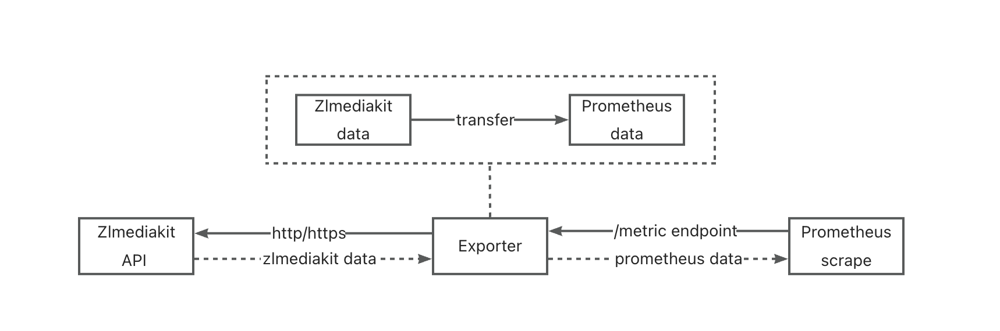

# ZLMediaKit Prometheus Exporter


[简体中文](./README.md) | English

Prometheus exporter for [ZLMediaKit](https://github.com/ZLMediaKit/ZLMediaKit) metrics, written in Go.

[](https://goreportcard.com/report/github.com/guohuachan/ZLMediaKit_exporter)
[](https://github.com/guohuachan/ZLMediaKit_exporter/blob/master/LICENSE)
[](https://en.cppreference.com/)
[](hhttps://github.com/guohuachan/ZLMediaKit_exporter/pulls)

## Grafana DEMO


Demo URL:
guest/guest

http://47.96.0.145:3000/d/adwaoe6v5tkw0a1/zlmediakit-new


## Workflow


## Usage

### Prerequisites

```yaml
# prometheus.yml
scrape_configs:
  - job_name: 'zlm_exporter'
    static_configs:
      - targets: ['<zlm_exporter_host>:9101']
```

### Docker

```shell
## pull image
docker pull zlmexporter/zlmexporter:latest
# OR build image
make build-image

## run container
docker run --rm --name zlm_exporter -p 9101:9101 \
  -e ZLM_API_URL=<zlmediakit_api_uri> \
  -e ZLM_API_SECRET=<zlmediakit_api_secret> \
  zlmexporter/zlmexporter:latest

## get metrics
curl http://localhost:9101/metrics
```

### Source
```shell
## clone repo
git clone https://github.com/guohuachan/ZLMediaKit_exporter
cd ZLMediaKit_exporter
## build
make build
## run
./zlm_exporter --zlm.api-url=<zlmediakit_api_uri> --zlm.secret=<zlmediakit_api_secret>
## get metrics
curl http://localhost:9101/metrics
```

## Command line flags

|  Name                      | Environment Variable Name                               | Description  |
|-------------------------   |-------------------------------------------|----------|
| `zlm.api-url`  |  ZLM_API_URL      |  URI on which to scrape zlmediakit metrics(ZlMediaKit apiServer url) default: http://localhost  |
| `zlm.secret`      | ZLM_API_SECRET            | Secret for the scrape URI            |
| `web.listen-address`| ZLM_EXPORTER_TELEMETRY_ADDRESS | Address to expose metrics. default: :9101 |
| `web.telemetry-path`| ZLM_EXPORTER_TELEMETRY_PATH| Path under which to expose metrics. default: /metrics |
| `web.ssl-verify` | ZLM_EXPORTER_SSL_VERIFY | Skip TLS verification. default: true |

## Metrics

| Metric Name                               | Labels                          | Description                      |
|-------------------------------------------|---------------------------------|----------------------------------|
| `zlm_version_info`                        | branchName、buildTime、commitHash | Version info of ZLMediakit       |
| `zlm_api_status`                          | endpoint                        | The status of API endpoint       |
| `zlm_network_threads_total`               | {}                                | Total number of network threads  |
| `zlm_network_threads_load_total`          | {}                                | Total of network threads load    |
| `zlm_network_threads_delay_total`         | {}                                | Total of network threads delay   |
| `zlm_work_threads_total`                  | {}                                | Total number of work threads     |
| `zlm_work_threads_load_total`             | {}                                | Total of work threads load       |
| `zlm_work_threads_delay_total`            | {}                                | Total of work threads delay      |
| `zlm_statistics_buffer`                   | {}                                | Statistics buffer                |
| `zlm_statistics_buffer_like_string`       | {}                                | Statistics BufferLikeString      |
| `zlm_statistics_buffer_list`              | {}                                | Statistics BufferList            |
| `zlm_statistics_buffer_raw`               | {}                                | Statistics BufferRaw             |
| `zlm_statistics_frame`                    | {}                                | Statistics Frame                 |
| `zlm_statistics_frame_imp`                | {}                                | Statistics FrameImp              |
| `zlm_statistics_media_source`             | {}                                | Statistics MediaSource           |
| `zlm_statistics_multi_media_source_muxer` | {}                                | Statistics MultiMediaSourceMuxer |
| `zlm_statistics_rtp_packet`               | {}                                | Statistics RtpPacket             |
| `zlm_statistics_socket`                   | {}                                | Statistics Socket                |
| `zlm_statistics_tcp_client`               | {}                                | Statistics TcpClient             |
| `zlm_statistics_tcp_server`               | {}                                | Statistics TcpServer             |
| `zlm_statistics_tcp_session`              | {}                                | Statistics TcpSession            |
| `zlm_statistics_udp_server`               | {}                                | Statistics UdpServer             |
| `zlm_statistics_udp_session`              | {}                                | Statistics UdpSession            |
| `zlm_session_info`                        | id、identifier、local_ip、local_port、peer_ip、peer_port、typeid | Session info                     |
| `zlm_session_total`                       | {}                                | Total number of sessions         |
| `zlm_stream_info`                         | vhost、app、stream、schema、origin_type、origin_url | Stream basic information         |
| `zlm_stream_status`                       | vhost、app、stream、schema         | Stream status (1: active with data flowing, 0: inactive) |
| `zlm_stream_reader_count`                | vhost、app、stream、schema         | Stream reader count              |
| `zlm_stream_total_reader_count`          | vhost、app、stream         | Total reader count across all schemas |
| `zlm_stream_bitrate`                     | vhost、app、stream、schema         | Stream bitrate                  |
| `zlm_stream_alive_second`                | vhost、app、stream、schema         | Stream alive second              |
| `zlm_stream_create_stamp`                | vhost、app、stream、schema         | Stream create stamp              |
| `zlm_stream_total`                       | {}                                | Total number of streams         |
| `zlm_rtp_server_info`                    | port、stream_id         | RTP server info                  |
| `zlm_rtp_server_total`                   | {}                                | Total number of RTP servers         |

<details>
<summary>Metrics details Example</summary>
# HELP zlm_api_status The status of API endpoint
# TYPE zlm_api_status gauge
zlm_api_status{endpoint="/index/"} 1
zlm_api_status{endpoint="/index/api/addFFmpegSource"} 1
zlm_api_status{endpoint="/index/api/addStreamProxy"} 1
zlm_api_status{endpoint="/index/api/addStreamPusherProxy"} 1
zlm_api_status{endpoint="/index/api/broadcastMessage"} 1
zlm_api_status{endpoint="/index/api/closeRtpServer"} 1
zlm_api_status{endpoint="/index/api/close_stream"} 1
zlm_api_status{endpoint="/index/api/close_streams"} 1
zlm_api_status{endpoint="/index/api/connectRtpServer"} 1
zlm_api_status{endpoint="/index/api/delFFmpegSource"} 1
zlm_api_status{endpoint="/index/api/delStreamProxy"} 1
zlm_api_status{endpoint="/index/api/delStreamPusherProxy"} 1
zlm_api_status{endpoint="/index/api/deleteRecordDirectory"} 1
zlm_api_status{endpoint="/index/api/delete_webrtc"} 1
zlm_api_status{endpoint="/index/api/downloadBin"} 1
zlm_api_status{endpoint="/index/api/downloadFile"} 1
zlm_api_status{endpoint="/index/api/getAllSession"} 1
zlm_api_status{endpoint="/index/api/getApiList"} 1
zlm_api_status{endpoint="/index/api/getMP4RecordFile"} 1
zlm_api_status{endpoint="/index/api/getMediaInfo"} 1
zlm_api_status{endpoint="/index/api/getMediaList"} 1
zlm_api_status{endpoint="/index/api/getMediaPlayerList"} 1
zlm_api_status{endpoint="/index/api/getProxyInfo"} 1
zlm_api_status{endpoint="/index/api/getProxyPusherInfo"} 1
zlm_api_status{endpoint="/index/api/getRtpInfo"} 1
zlm_api_status{endpoint="/index/api/getServerConfig"} 1
zlm_api_status{endpoint="/index/api/getSnap"} 1
zlm_api_status{endpoint="/index/api/getStatistic"} 1
zlm_api_status{endpoint="/index/api/getThreadsLoad"} 1
zlm_api_status{endpoint="/index/api/getWorkThreadsLoad"} 1
zlm_api_status{endpoint="/index/api/isMediaOnline"} 1
zlm_api_status{endpoint="/index/api/isRecording"} 1
zlm_api_status{endpoint="/index/api/kick_session"} 1
zlm_api_status{endpoint="/index/api/kick_sessions"} 1
zlm_api_status{endpoint="/index/api/listFFmpegSource"} 1
zlm_api_status{endpoint="/index/api/listRtpSender"} 1
zlm_api_status{endpoint="/index/api/listRtpServer"} 1
zlm_api_status{endpoint="/index/api/listStreamProxy"} 1
zlm_api_status{endpoint="/index/api/listStreamPusherProxy"} 1
zlm_api_status{endpoint="/index/api/loadMP4File"} 1
zlm_api_status{endpoint="/index/api/openRtpServer"} 1
zlm_api_status{endpoint="/index/api/openRtpServerMultiplex"} 1
zlm_api_status{endpoint="/index/api/pauseRtpCheck"} 1
zlm_api_status{endpoint="/index/api/restartServer"} 1
zlm_api_status{endpoint="/index/api/resumeRtpCheck"} 1
zlm_api_status{endpoint="/index/api/seekRecordStamp"} 1
zlm_api_status{endpoint="/index/api/setRecordSpeed"} 1
zlm_api_status{endpoint="/index/api/setServerConfig"} 1
zlm_api_status{endpoint="/index/api/startRecord"} 1
zlm_api_status{endpoint="/index/api/startSendRtp"} 1
zlm_api_status{endpoint="/index/api/startSendRtpPassive"} 1
zlm_api_status{endpoint="/index/api/startSendRtpTalk"} 1
zlm_api_status{endpoint="/index/api/stopRecord"} 1
zlm_api_status{endpoint="/index/api/stopSendRtp"} 1
zlm_api_status{endpoint="/index/api/updateRtpServerSSRC"} 1
zlm_api_status{endpoint="/index/api/version"} 1
zlm_api_status{endpoint="/index/api/webrtc"} 1
zlm_api_status{endpoint="/index/api/whep"} 1
zlm_api_status{endpoint="/index/api/whip"} 1
# HELP zlm_exporter_scrapes_total Current total ZLMediaKit scrapes.
# TYPE zlm_exporter_scrapes_total counter
zlm_exporter_scrapes_total 3
# HELP zlm_network_threads_delay_total Total of network threads delay
# TYPE zlm_network_threads_delay_total gauge
zlm_network_threads_delay_total 0
# HELP zlm_network_threads_load_total Total of network threads load
# TYPE zlm_network_threads_load_total gauge
zlm_network_threads_load_total 0
# HELP zlm_network_threads_total Total number of network threads
# TYPE zlm_network_threads_total gauge
zlm_network_threads_total 8
# HELP zlm_rtp_server_total Total number of RTP servers
# TYPE zlm_rtp_server_total gauge
zlm_rtp_server_total 0
# HELP zlm_session_info Session info
# TYPE zlm_session_info gauge
zlm_session_info{id="225684-59",identifier="225684-59",local_ip="172.17.0.2",local_port="80",peer_ip="172.17.0.1",peer_port="60950",typeid="mediakit::HttpSession"} 1
zlm_session_info{id="225695-61",identifier="225695-61",local_ip="172.17.0.2",local_port="80",peer_ip="172.17.0.1",peer_port="61062",typeid="mediakit::HttpSession"} 1
zlm_session_info{id="225696-62",identifier="225696-62",local_ip="172.17.0.2",local_port="554",peer_ip="172.17.0.1",peer_port="61154",typeid="mediakit::RtspSession"} 1
zlm_session_info{id="225697-65",identifier="225697-65",local_ip="172.17.0.2",local_port="80",peer_ip="172.17.0.1",peer_port="57828",typeid="mediakit::HttpSession"} 1
zlm_session_info{id="225698-90",identifier="225698-90",local_ip="172.17.0.2",local_port="80",peer_ip="172.17.0.1",peer_port="57832",typeid="mediakit::HttpSession"} 1
zlm_session_info{id="225699-91",identifier="225699-91",local_ip="172.17.0.2",local_port="80",peer_ip="172.17.0.1",peer_port="57846",typeid="mediakit::HttpSession"} 1
zlm_session_info{id="225700-92",identifier="225700-92",local_ip="172.17.0.2",local_port="80",peer_ip="172.17.0.1",peer_port="57844",typeid="mediakit::HttpSession"} 1
zlm_session_info{id="225701-63",identifier="225701-63",local_ip="172.17.0.2",local_port="80",peer_ip="172.17.0.1",peer_port="57812",typeid="mediakit::HttpSession"} 1
zlm_session_info{id="225702-64",identifier="225702-64",local_ip="172.17.0.2",local_port="80",peer_ip="172.17.0.1",peer_port="57816",typeid="mediakit::HttpSession"} 1
# HELP zlm_session_total Total number of sessions
# TYPE zlm_session_total gauge
zlm_session_total 9
# HELP zlm_statistics_buffer Statistics buffer
# TYPE zlm_statistics_buffer gauge
zlm_statistics_buffer 1496
# HELP zlm_statistics_buffer_like_string Statistics BufferLikeString
# TYPE zlm_statistics_buffer_like_string gauge
zlm_statistics_buffer_like_string 254
# HELP zlm_statistics_buffer_list Statistics BufferList
# TYPE zlm_statistics_buffer_list gauge
zlm_statistics_buffer_list 0
# HELP zlm_statistics_buffer_raw Statistics BufferRaw
# TYPE zlm_statistics_buffer_raw gauge
zlm_statistics_buffer_raw 560
# HELP zlm_statistics_frame Statistics Frame
# TYPE zlm_statistics_frame gauge
zlm_statistics_frame 278
# HELP zlm_statistics_frame_imp Statistics FrameImp
# TYPE zlm_statistics_frame_imp gauge
zlm_statistics_frame_imp 109
# HELP zlm_statistics_media_source Statistics MediaSource
# TYPE zlm_statistics_media_source gauge
zlm_statistics_media_source 7
# HELP zlm_statistics_multi_media_source_muxer Statistics MultiMediaSourceMuxer
# TYPE zlm_statistics_multi_media_source_muxer gauge
zlm_statistics_multi_media_source_muxer 1
# HELP zlm_statistics_rtmp_packet Statistics RtmpPacket
# TYPE zlm_statistics_rtmp_packet gauge
zlm_statistics_rtmp_packet 136
# HELP zlm_statistics_rtp_packet Statistics RtpPacket
# TYPE zlm_statistics_rtp_packet gauge
zlm_statistics_rtp_packet 167
# HELP zlm_statistics_socket Statistics Socket
# TYPE zlm_statistics_socket gauge
zlm_statistics_socket 82
# HELP zlm_statistics_tcp_client Statistics TcpClient
# TYPE zlm_statistics_tcp_client gauge
zlm_statistics_tcp_client 1
# HELP zlm_statistics_tcp_server Statistics TcpServer
# TYPE zlm_statistics_tcp_server gauge
zlm_statistics_tcp_server 51
# HELP zlm_statistics_tcp_session Statistics TcpSession
# TYPE zlm_statistics_tcp_session gauge
zlm_statistics_tcp_session 8
# HELP zlm_statistics_udp_server Statistics UdpServer
# TYPE zlm_statistics_udp_server gauge
zlm_statistics_udp_server 24
# HELP zlm_statistics_udp_session Statistics UdpSession
# TYPE zlm_statistics_udp_session gauge
zlm_statistics_udp_session 0
# HELP zlm_stream_alive_second Stream alive second
# TYPE zlm_stream_alive_second gauge
zlm_stream_alive_second{app="live",schema="fmp4",stream="test",vhost="__defaultVhost__"} 6
zlm_stream_alive_second{app="live",schema="rtmp",stream="test",vhost="__defaultVhost__"} 6
zlm_stream_alive_second{app="live",schema="rtsp",stream="test",vhost="__defaultVhost__"} 6
zlm_stream_alive_second{app="live",schema="ts",stream="test",vhost="__defaultVhost__"} 6
# HELP zlm_stream_bitrate Stream bitrate
# TYPE zlm_stream_bitrate gauge
zlm_stream_bitrate{app="live",schema="fmp4",stream="test",vhost="__defaultVhost__"} 27332
zlm_stream_bitrate{app="live",schema="rtmp",stream="test",vhost="__defaultVhost__"} 22185
zlm_stream_bitrate{app="live",schema="rtsp",stream="test",vhost="__defaultVhost__"} 20864
zlm_stream_bitrate{app="live",schema="ts",stream="test",vhost="__defaultVhost__"} 26328
# HELP zlm_stream_create_stamp Stream create stamp
# TYPE zlm_stream_create_stamp gauge
zlm_stream_create_stamp{app="live",schema="fmp4",stream="test",vhost="__defaultVhost__"} 1.743913981e+09
zlm_stream_create_stamp{app="live",schema="rtmp",stream="test",vhost="__defaultVhost__"} 1.743913981e+09
zlm_stream_create_stamp{app="live",schema="rtsp",stream="test",vhost="__defaultVhost__"} 1.743913981e+09
zlm_stream_create_stamp{app="live",schema="ts",stream="test",vhost="__defaultVhost__"} 1.743913981e+09
# HELP zlm_stream_info Stream basic information
# TYPE zlm_stream_info gauge
zlm_stream_info{app="live",origin_type="rtsp_push",origin_url="rtsp://127.0.0.1:8554/live/test",schema="fmp4",stream="test",vhost="__defaultVhost__"} 1
zlm_stream_info{app="live",origin_type="rtsp_push",origin_url="rtsp://127.0.0.1:8554/live/test",schema="rtmp",stream="test",vhost="__defaultVhost__"} 1
zlm_stream_info{app="live",origin_type="rtsp_push",origin_url="rtsp://127.0.0.1:8554/live/test",schema="rtsp",stream="test",vhost="__defaultVhost__"} 1
zlm_stream_info{app="live",origin_type="rtsp_push",origin_url="rtsp://127.0.0.1:8554/live/test",schema="ts",stream="test",vhost="__defaultVhost__"} 1
# HELP zlm_stream_reader_count Stream reader count
# TYPE zlm_stream_reader_count gauge
zlm_stream_reader_count{app="live",schema="fmp4",stream="test",vhost="__defaultVhost__"} 0
zlm_stream_reader_count{app="live",schema="rtmp",stream="test",vhost="__defaultVhost__"} 0
zlm_stream_reader_count{app="live",schema="rtsp",stream="test",vhost="__defaultVhost__"} 0
zlm_stream_reader_count{app="live",schema="ts",stream="test",vhost="__defaultVhost__"} 0
# HELP zlm_stream_status Stream status (1: active with data flowing, 0: inactive)
# TYPE zlm_stream_status gauge
zlm_stream_status{app="live",schema="fmp4",stream="test",vhost="__defaultVhost__"} 1
zlm_stream_status{app="live",schema="rtmp",stream="test",vhost="__defaultVhost__"} 1
zlm_stream_status{app="live",schema="rtsp",stream="test",vhost="__defaultVhost__"} 1
zlm_stream_status{app="live",schema="ts",stream="test",vhost="__defaultVhost__"} 1
# HELP zlm_stream_total Total number of streams
# TYPE zlm_stream_total gauge
zlm_stream_total 1
# HELP zlm_stream_total_reader_count Total reader count across all schemas
# TYPE zlm_stream_total_reader_count gauge
zlm_stream_total_reader_count{app="test",stream="__defaultVhost__",vhost="live"} 0
# HELP zlm_up Was the last scrape of ZLMediaKit successful.
# TYPE zlm_up gauge
zlm_up 1
# HELP zlm_version_info ZLMediaKit version info.
# TYPE zlm_version_info gauge
zlm_version_info{branchName="master",buildTime="2025-03-21T07:30:47",commitHash="f0204ea"} 1
# HELP zlm_work_threads_delay_total Total of work threads delay
# TYPE zlm_work_threads_delay_total gauge
zlm_work_threads_delay_total 0
# HELP zlm_work_threads_load_total Total of work threads load
# TYPE zlm_work_threads_load_total gauge
zlm_work_threads_load_total 0
# HELP zlm_work_threads_total Total number of work threads
# TYPE zlm_work_threads_total gauge
zlm_work_threads_total 8

</details>

## Roadmap

- [x] Add git action CI/CD,and trigger docker build and push to docker hub
- [x] GA
- [x] Add grafana dashboard / prometheus alert example
- [ ] Add disable exporting key-value metrics
- [ ] Add more tests

## Contributing and reporting issues

JUST DO IT! 

We appreciate your feedback and contributions!


## Thanks
[ZLMediaKit](https://github.com/ZLMediaKit/ZLMediaKit)

[JetBrains](https://www.jetbrains.com/)

[redis_exporter](https://github.com/oliver006/redis_exporter)

[haproxy_exporter](https://github.com/prometheus/haproxy_exporter)

[Prometheus](https://prometheus.io/)

[Cursor](https://www.cursor.com/)

JetBrains/Cursor provides great IDE for coding.

Most unittest powered by Cursor.